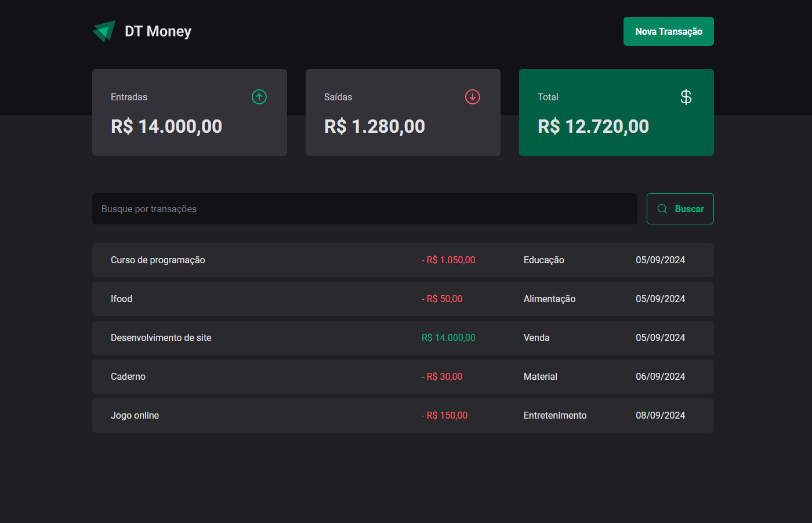
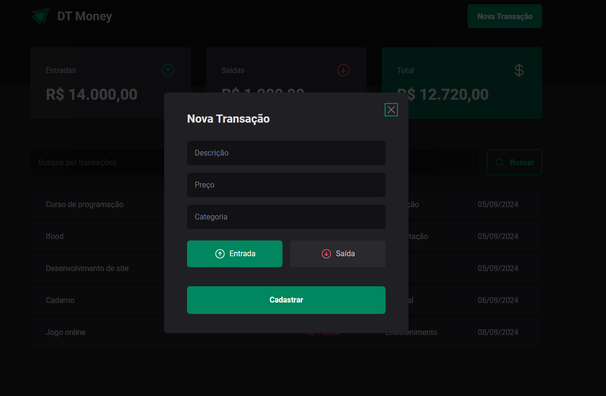

# 💸 DT Money

(Projeto de estudo) DT Money é uma aplicação de controle financeiro, onde os usuários podem gerenciar suas entradas e saídas de dinheiro, visualizar o saldo total, e filtrar transações. A aplicação é desenvolvida em **React** e utiliza **Context API**, **Axios** para chamadas de API e **JSON Server** para simular uma API backend.

## 📸 Demonstração




## 🚀 Tecnologias Utilizadas

- **React.js**: Biblioteca JavaScript para construir interfaces de usuário.
- **TypeScript**: Superset do JavaScript que adiciona tipagem estática.
- **Styled-components**: Para estilização dos componentes de forma mais modular.
- **Axios**: Biblioteca para fazer requisições HTTP.
- **JSON Server**: API fake para simular as transações.
- **React Hook Form**: Para gerenciamento de formulários.
- **Zod**: Para validação de formulários com integração ao React Hook Form.
- **React Context API**: Para gerenciamento de estado global da aplicação.
- **React Icons (Phosphor Icons)**: Para ícones reutilizáveis.

## 📝 Funcionalidades

- **Registrar novas transações**: Inserir novas entradas e saídas financeiras.
- **Visualização de saldo**: Exibe o saldo total, entradas e saídas.
- **Busca de transações**: Permite ao usuário filtrar transações por termos de busca.
- **Listagem de transações**: Mostra uma lista com as transações, com valores formatados.
- **Filtragem inteligente**: Busca realizada em todos os campos das transações.

## ⚙️ Como Rodar o Projeto

### Pré-requisitos

- **Node.js** (versão 14 ou superior)
- **npm** ou **yarn**

### Passo a Passo

1. **Clone o repositório**:

   ```bash
   git clone https://github.com/seu-usuario/dt-money.git
   cd dt-money
   ```

2. **Instale as dependências**:

   Se estiver usando **npm**:

   ```bash
   npm install
   ```

   Ou se estiver usando **yarn**:

   ```bash
   yarn install
   ```

3. **Rodando o servidor de desenvolvimento**:

   ```bash
   npm run dev
   ```

   Ou com **yarn**:

   ```bash
   yarn dev
   ```

4. **Rodando o JSON Server**:

   O JSON Server simula uma API que serve as transações. Execute o seguinte comando em uma nova aba do terminal:

   ```bash
   npm run dev:server
   ```

   Ou com **yarn**:

   ```bash
   yarn dev:server
   ```

   O servidor será executado em: [http://localhost:3000](http://localhost:3000)

### Endpoints do JSON Server

A API fake está rodando no endpoint:

```bash
http://localhost:3000/transactions
```

### Estrutura de Dados (Exemplo de Transação)

```json
{
  "id": 1,
  "description": "Desenvolvimento de site",
  "type": "income",
  "category": "Venda",
  "price": 14000,
  "createdAt": "2024-09-05T18:51:53.876Z"
}
```

## 🛠️ Ferramentas e Conceitos Utilizados

### React Hooks Utilizados

- **useState**: Para gerenciamento de estados locais.
- **useEffect**: Para executar efeitos colaterais (ex. buscar dados da API).
- **useContext**: Para compartilhar estado global com diferentes componentes.
- **useMemo**: Para otimizar cálculos e filtragens de dados.
- **useCallback**: Para memorizar funções e evitar renderizações desnecessárias.

### Gerenciamento de Estado com Context API

A aplicação utiliza **Context API** para gerenciar as transações e suas ações globais, como a função de `fetchTransactions` para buscar dados.

### Validação de Formulários com Zod

A validação dos dados de formulários é feita com a integração entre o **React Hook Form** e o **Zod**, garantindo que os dados inseridos estejam no formato correto.

### Axios e JSON Server

- O **Axios** é utilizado para fazer chamadas HTTP à API fake (simulada pelo **JSON Server**).
- O **JSON Server** é uma ferramenta simples para criar uma API fake rapidamente e serve as transações como se fosse um backend real.

## 📂 Estrutura de Pastas

```bash
src/
  ├── assets/          # Imagens, ícones e outros recursos
  ├── components/      # Componentes reutilizáveis da aplicação
  ├── contexts/        # Definição dos contextos globais
  ├── hooks/           # Hooks personalizados
  ├── pages/           # Páginas principais da aplicação
  ├── services/        # Configuração de APIs e chamadas HTTP
  ├── styles/          # Estilos globais e temas
  └── App.tsx          # Componente raiz
```

## 📦 Instalação e Execução para Desenvolvimento

1. Clone o repositório:

```bash
git clone https://github.com/rodgondin/dt-money.git
```

2. Instale as dependências:

```bash
npm install
# ou
yarn install
```

3. Inicie o servidor de desenvolvimento:

```bash
npm run dev
# ou
yarn dev
```

4. Inicie o servidor JSON:

```bash
npm run dev:server
# ou
yarn dev:server
```

Acesse a aplicação no navegador em `http://localhost:3000`.

**Projeto de estudo fornecido pela @Rocketseat.**
